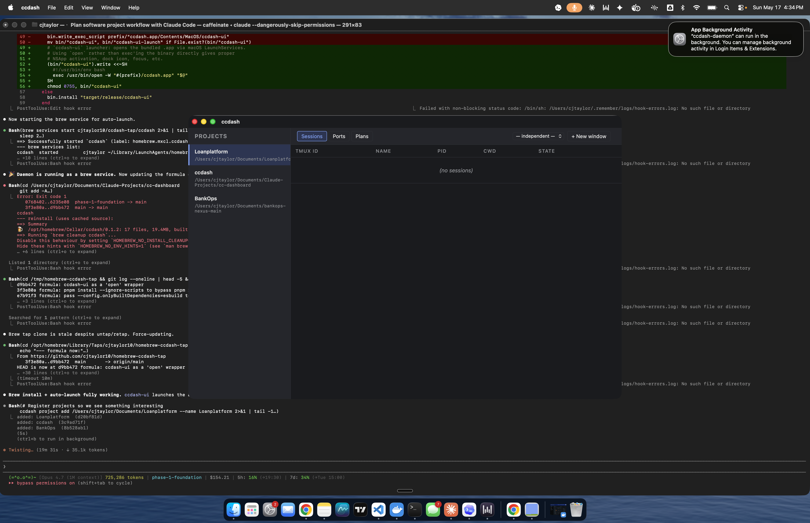

# ccdash

[](https://opensource.org/licenses/MIT)
[](https://github.com/cjtaylor10/ccdash)
[](https://github.com/cjtaylor10/ccdash)

A local desktop dashboard for **managing many parallel Claude Code sessions** across projects, worktrees, and ports.

When you run Claude at scale — a half-dozen projects, each with 5–8 worktrees, multiple sessions running in parallel — your Terminal stops being a workspace and starts being a graveyard of windows. ccdash gives you one cohesive view of what's running where, what's planned, and what's stuck, with embedded interactive terminals so you can attach to any session from any window.



*Screenshot from an early build during v0.1.x shipping. The v1.0 release adds a 4th Browser tab, a command palette, theme toggle, drag-reorder, and a fresh app icon.*

```bash
brew tap cjtaylor10/ccdash-tap
brew install cjtaylor10/ccdash-tap/ccdash
brew services start cjtaylor10/ccdash-tap/ccdash
ccdash project add ~/path/to/your/repo
ccdash-ui
```

## Features

**Project + worktree registry**
- One sidebar entry per registered git repo, with sub-rows per worktree.
- Drag-and-drop reorder; right-click → Remove project.
- First-run welcome modal scans configured directories and bulk-adds discovered repos.

**Embedded interactive terminals**
- `xterm.js` terminals wrap `tmux attach-session` — every Claude session is tmux-backed, so sessions survive ccdash crashes and you can attach from the CLI or from another window.
- Multi-window support with optional mirror mode: open ccdash on a second monitor following the first window's selection.

**Port conflict prevention**
- Daemon scans live TCP listeners and parses declared ports from `package.json`, `.env`, `docker-compose.yml`, `Procfile`.
- "Launch session" pre-flight checks for conflicts; when found, surfaces the holders and offers one-click rebind via a force token.

**Plan progress tracking**
- Auto-parses `docs/superpowers/{specs,plans}/**/*.md` per project.
- Renders phases/tasks with progress bars. Inline markdown rendering. Click "Open in VS Code" to jump to the source file.

**Embedded browser preview**
- 4th top-level tab. Auto-detects loopback URLs from running TCP listeners *and* live terminal output (e.g., `Local: http://localhost:5173`).
- Iframe-based with back/forward/reload + "Open in external browser" escape hatch.

**Polish**
- Command palette (`Cmd+K`): type-ahead over project switches, common actions, tab navigation.
- Keyboard shortcuts: `Cmd+N` new window, `Cmd+W` close window, `Cmd+L` launch session.
- Theme toggle: Auto / Dark / Light. Persisted to localStorage.
- Daemon health indicator. Auto-reconnect on daemon restart with exponential backoff.

## Quick start

```bash
brew tap cjtaylor10/ccdash-tap
brew install cjtaylor10/ccdash-tap/ccdash

# Start the daemon (launchd / systemd user unit auto-loads on next login):
brew services start cjtaylor10/ccdash-tap/ccdash

# Add a project and launch the UI:
ccdash project add ~/path/to/repo
ccdash-ui
```

The first run shows a welcome flow that lets you bulk-add projects by scanning a directory.

See [INSTALL.md](./INSTALL.md) for full installation details, source-build instructions, and Linux-specific notes.

## How it compares

| | ccdash | tmuxinator / overmind | iTerm / WezTerm tabs | A Notion doc |
|---|---|---|---|---|
| Survives terminal crash | ✅ (tmux) | ✅ (tmux) | ❌ | n/a |
| Multi-project view | ✅ | ❌ | ❌ | ✅ (manual) |
| Port conflict gating | ✅ | ❌ | ❌ | ❌ |
| Plan progress tracking | ✅ | ❌ | ❌ | ✅ (manual) |
| Attach from any window | ✅ | ✅ | ❌ | ❌ |
| Live dev-server preview | ✅ | ❌ | ❌ | ❌ |
| Designed for Claude Code | ✅ | ❌ | ❌ | ❌ |

## Architecture

```
   ┌────────────────────────────────────────────────────────────┐
   │  ccdash-daemon (long-lived Rust process)                   │
   │  • tmux session manager (control-mode + polling)           │
   │  • project + worktree registry (~/.ccdash/projects.toml)   │
   │  • port registry (lsof scan + declared-port parsers)       │
   │  • plan watcher (parses docs/superpowers/{specs,plans}/)   │
   │  • event bus (JSON-RPC 2.0 over Unix socket)               │
   └────────────────────────────────────────────────────────────┘
              ▲                          ▲
              │  JSON-RPC                │  JSON-RPC
              │  $SOCK                   │
   ┌──────────┴───────────┐    ┌─────────┴────────────────────┐
   │  ccdash CLI          │    │  ccdash-ui (Tauri 2)         │
   │  Rust binary         │    │  Rust backend = proxy        │
   │                      │    │  Plain Svelte 5 frontend     │
   │  launch, list,       │    │  xterm.js terminals          │
   │  kill, status,       │    │  multi-window + mirror       │
   │  ports, plan, …      │    │  iframe browser preview      │
   └──────────────────────┘    └──────────────────────────────┘
```

- **`ccdash-core`** — shared protocol + client library.
- **`ccdash-daemon`** — long-lived JSON-RPC service. Auth-gated socket (`/tmp/ccdash.sock`), token at `~/.ccdash/auth`. Auto-starts via launchd / systemd.
- **`ccdash-cli`** — `ccdash` command-line client (7 subcommands).
- **`apps/ccdash-ui`** — Tauri 2 desktop app: Rust backend proxies to the daemon, plain Vite + Svelte 5 frontend.

Full design rationale in [`docs/superpowers/specs/2026-05-17-cc-dashboard-design.md`](./docs/superpowers/specs/2026-05-17-cc-dashboard-design.md).

## Status

**v1.0** — feature-complete for personal workflows on macOS and Linux. Eight implementation phases across project foundation → packaging → UI parity → polish → Linux verification. 85 automated tests, 1 ignored tmux smoke. Source-build ad-hoc-signed on macOS; full Apple Developer signing deferred to a future release.

Deferred to a future release:
- Apple Developer code-signing + notarization (currently ad-hoc signed)
- Tauri 2 auto-updater plugin (gates on signing)
- Native Windows support
- Live edit of plan markdown from inside the dashboard

## Build from source

```bash
git clone https://github.com/cjtaylor10/ccdash.git
cd ccdash
# Prereqs on macOS: rust 1.83+, node, pnpm, tmux, cargo install tauri-cli@^2
./packaging/scripts/release.sh
```

For Linux: install the system deps listed in [INSTALL.md](./INSTALL.md). Verify with the Docker test image:

```bash
docker build -f packaging/linux/Dockerfile.test --target daemon-only -t ccdash-linux .
```

## License

MIT — see [LICENSE](./LICENSE).
